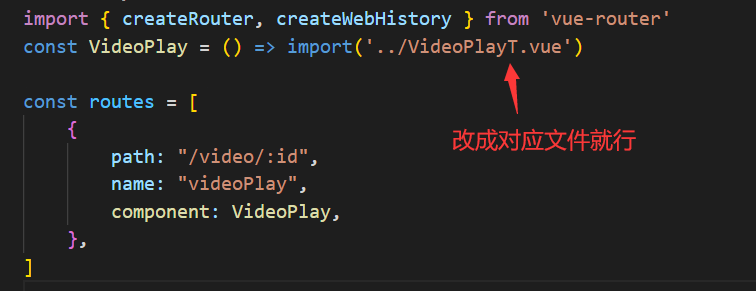

# video-demo-frontend

## 说明

本开源代码是我在做弹幕视频网站过程中的练手项目，所以很多功能都没写全，只写了关键部分，本仓库只是demo的前端部分，需要与后端代码结合来看，后端代码请移步：[分片上传以及流式播放的简单示例后端（springboot2.7 + mybatis-plus）](https://github.com/xunlu129/video-demo-backend)

## 技术栈

开发语言：vue3

使用技术：axios，video.js，sparkmd5

## 主要功能

实现将视频分片后上传，点开视频以流的形式播放

## 运行步骤

#### 1、构筑依赖

```bash
npm install
```

#### 2、运行程序

```bash
npm run serve
```

## 详细说明

由于是0经验开始开发，早期走了许多弯路，我弄了三个版本


`S` 和 `T` 分别是第二版和第三版的意思

- 第一版用的不是流式播放，而是整块下载，就是将视频全部缓存到浏览器后再开始播放，缺点是等待时间长，大一点的视频要加载好久才能播放
- 第二版我参考了很多网上资料做的，想法是以流的形式边加载边播放，但是不知道为什么播放不了，一直想不通原因，就放弃了
- 第三版直接采用依赖包 `video.js`，实现了流式播放，即视频可以边看边加载，能有效减少流量的浪费，并且响应也很快

需要看不同版本效果的话就在 router 的 `index.js` 文件里修改定向地址就好了


